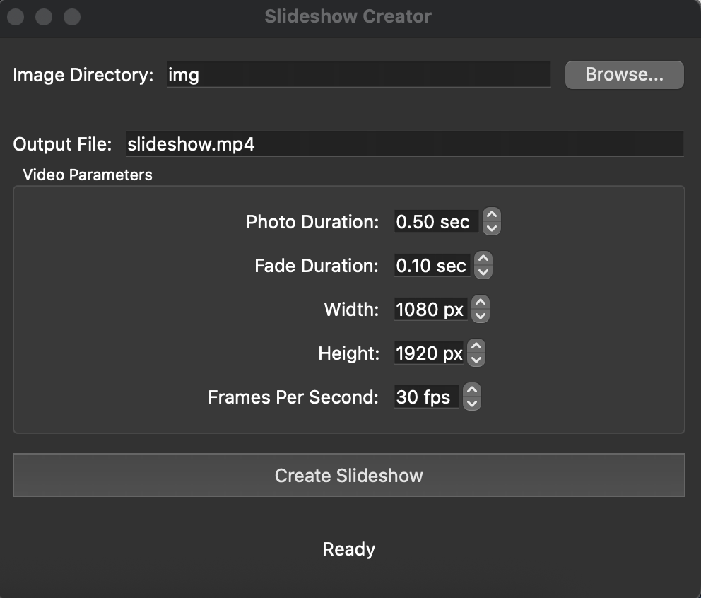

# VideoBurst: Fast Slideshow Creator

VideoBurst is a streamlined application for creating rapid-fire slideshows.


## Features

- **Quick Slideshows**: Generate fast-paced slideshows with configurable timing
- **Smooth Transitions**: Add crossfade effects between images
- **Vertical Format**: Default 9:16 aspect ratio optimized for mobile platforms
- **Customizable**: Adjust photo duration, fade effects, resolution, and framerate
- **Cross-Platform**: Works on macOS, Windows, and Linux

## Installation

### Download Pre-built Application

#### macOS
1. Download the latest release from the [Releases](https://github.com/rowanmorkner/videoburst/releases) page
2. Unzip the downloaded file
3. Drag the "Slideshow Creator.app" to your Applications folder
4. Right-click and select "Open" the first time you run it (to bypass macOS security)

#### Windows
1. Download the latest release from the [Releases](https://github.com/rowanmorkner/videoburst/releases) page
2. Unzip the downloaded file
3. Run the "Slideshow Creator.exe" executable

### Building from Source

#### Prerequisites
- Python 3.6 or higher
- FFmpeg (must be installed and available in your system PATH)
- pip (Python package manager)

#### Setup
1. Clone this repository:
   ```
   git clone https://github.com/yourusername/videoburst.git
   cd videoburst
   ```

2. Create a virtual environment (optional but recommended):
   ```
   python -m venv venv
   source venv/bin/activate  # On Windows: venv\Scripts\activate
   ```

3. Install dependencies:
   ```
   pip install -r requirements.txt
   ```

4. Run the application:
   ```
   python src/slideshow_app.py
   ```

## Usage

1. **Select Image Directory**: Click "Browse..." to select a folder containing your images
2. **Configure Settings**: Adjust slideshow parameters:
   - Photo Duration: How long each image appears (in seconds)
   - Fade Duration: Length of crossfade between images (in seconds)
   - Width/Height: Video resolution
   - FPS: Frames per second (higher = smoother video, larger file)
3. **Output Location**: Specify where to save the output video
4. **Create Slideshow**: Click "Create Slideshow" to generate your video
5. **Wait for Processing**: The app will show a progress indicator while creating your slideshow
6. **Done!**: When complete, your slideshow will be saved to the specified location

## Command Line Usage

For advanced users or automation, you can also use the command-line interface:

```
python src/create_slideshow.py --directory /path/to/images --output slideshow.mp4 --photo-duration 0.1 --fade-duration 0.05
```

Run `python src/create_slideshow.py --help` for a complete list of options.

## Building Standalone Applications

To create standalone executables (no Python installation required):

1. Install PyInstaller:
   ```
   pip install pyinstaller
   ```

2. Generate the application:
   ```
   # For macOS:
   python src/app_icon.py  # Create app icon first
   pyinstaller --windowed --icon=app.icns --name="Slideshow Creator" src/slideshow_app.py --add-data "src/create_slideshow.py:."
   
   # For Windows:
   pyinstaller --windowed --icon=app.ico --name="Slideshow Creator" src/slideshow_app.py --add-data "src/create_slideshow.py;."
   ```

3. The standalone application will be created in the `dist` directory

## Requirements

- Python 3.6+
- PIL/Pillow (Python Imaging Library)
- numpy
- imageio
- tqdm
- FFmpeg (external dependency)
- PyQt6 (for GUI version)

## License

This project is licensed under the MIT License - see the [LICENSE](LICENSE) file for details.

## Acknowledgments

- FFmpeg team for the powerful video processing capabilities
- PyQt team for the cross-platform GUI framework
- All contributors to the open-source dependencies

## Contributing

Contributions are welcome! Please feel free to submit a Pull Request.
